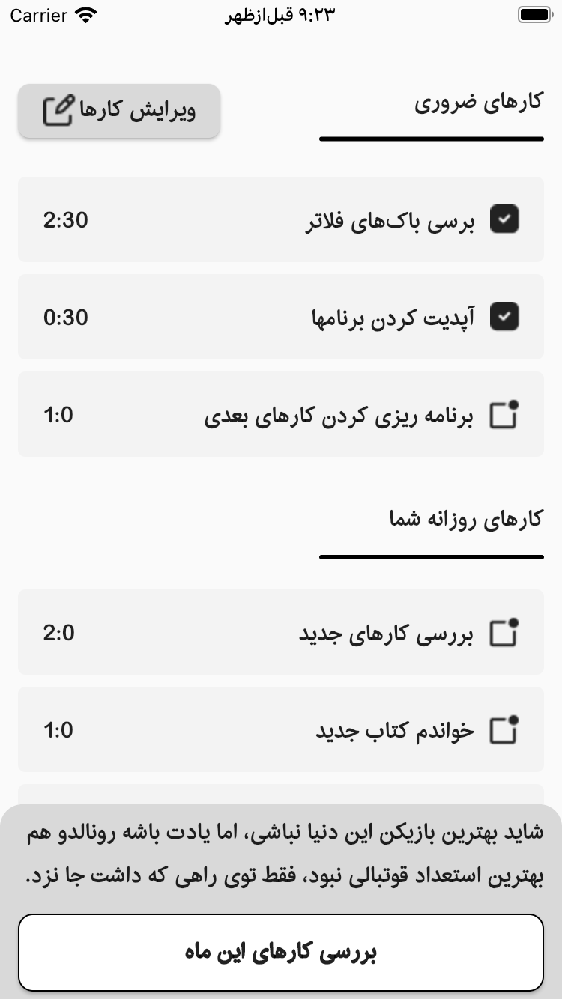

# taskboard

the application for management daily and monthly tasks

## applicatin screenshot

## application bugs
this app has the first version of release and maybe you get the bug when workiing with app. so if you see app bug create issue and warning to me

## used tech:
- bloc architectrue and cubit pattern
- use hive database
- localization
- jalaji calender
